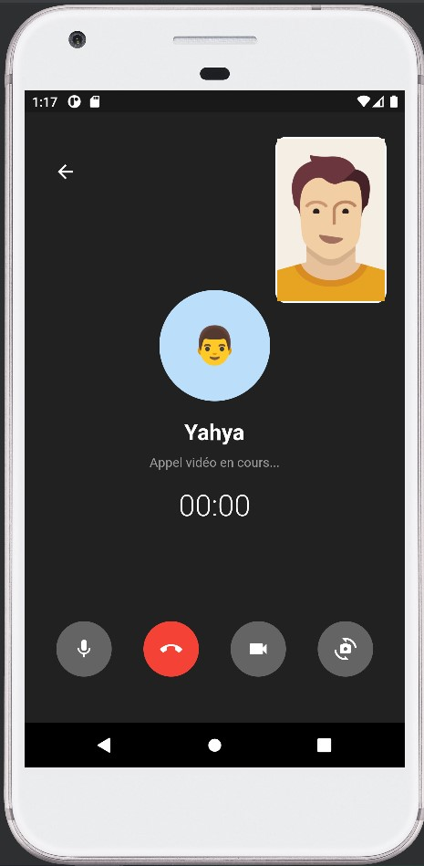

# User interface for a chat application with Flutter

========================================================

A Chat app UI Flutter project.

#### Page d'accueil :

#### Page de discussion :

#### Page d'appelle vocale :

#### Page d'appele video :

#### Page d'historique d'appelles :

#### Page de profil :

## Getting Started

This project is a starting point for a Flutter application.

A few resources to get you started if this is your first Flutter project:

- [Lab: Write your first Flutter app](https://docs.flutter.dev/get-started/codelab)
- [Cookbook: Useful Flutter samples](https://docs.flutter.dev/cookbook)

For help getting started with Flutter development, view the
[online documentation](https://docs.flutter.dev/), which offers tutorials,
samples, guidance on mobile development, and a full API reference.
